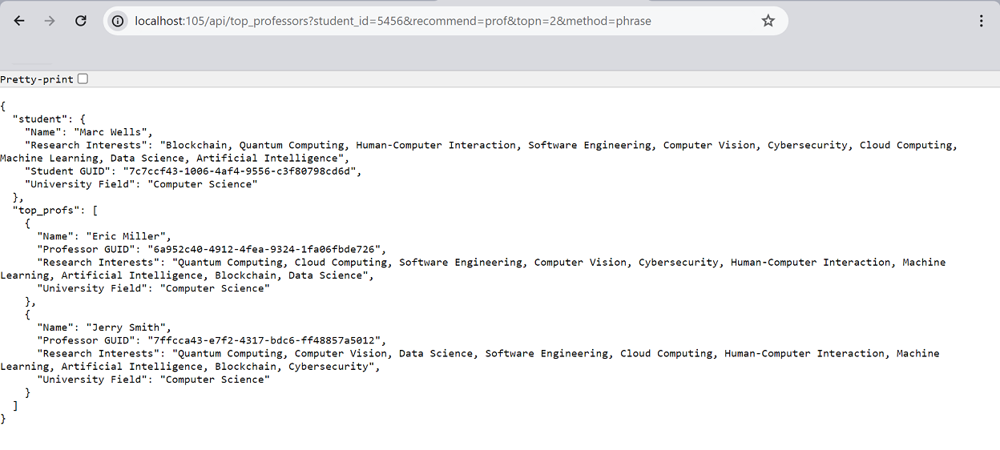

# Academic-Recommender

A basic word-embedding model to find best matching students or professors, and recommend the top n results
to a specific student. It can be considered as a basic similarity-based recommender system, where system
input is only a list of strings, and the system finds most similar strings based on their embedded
vectors only.

## Requirements
- The code has been written in **Python 3.9.x**
- Install dependencies using `pip install -r requirements.txt`

## Supported Model Libraries
Currently, it only supports models available in **Gensim** and **HuggingFace**. Word embedding models are
only accpeted, where the model can get words as input and returns their embedded vector as output.

## Models
Code has been tested successfully with these pretrained models:
- FastText: `fasttext-wiki-news-subwords-300`
- Word2Vec: `Word2vec/wikipedia2vec_enwiki_20180420_100d`, `word2vec-google-news-300`
- GloVe: `glove-wiki-gigaword-50`, `glove-wiki-gigaword-300`, `glove-twitter-200`

Training/fine-tuning models on external data is also possible, while relevant datasets are rare.

## Documentation
To see an overview of the project and a brief report, open the [proof_of_concept](./proof_of_concept.ipynb) 
notebook. Also, to see a comparison of different algorithms in terms of model size, inference speed, and 
performance over the edge cases, see [method_comparison](./method_comparison_cases.pdf) PDF file.

## How to Run
It usually takes 4 to 20 seconds to see the results, depending on model weight, dataset size, and 
string splitting method/similarity algorithm.
### Using Main File
Open the project in an IDE, run the `main.py` file. Global variables such as `SPLIT_METHOD` are defined 
after importing libraries, and can be changed manually.

### Using Local API
Run this command in the CLI to open a local Flask API:

`python ./app.py -dataset=university_data.xlsx -model_lib=gensim -model_name=fasttext-wiki-news-subwords-300`

Go to `http://0.0.0.0:105` or `http://127.0.0.1:105`. Full url must also have other params, for example:

`http://localhost:105/api/top_professors?student_id=5456&recommend=prof&topn=5&method=phrase`

API json response would look like this:

